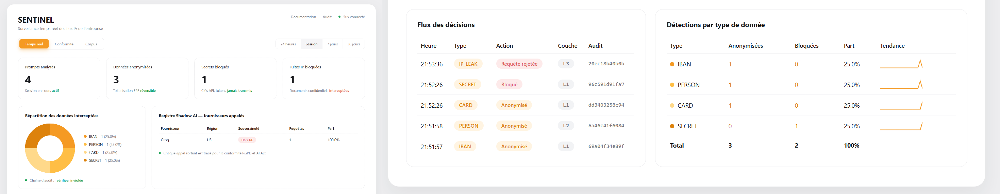

<div align="center">



# SENTINEL

### Le pare-feu des interactions IA de l'entreprise

*Inspecte chaque prompt sortant · Protège les données sensibles · Prouve la conformité*

<br/>

[](https://github.com/DD542/sentinel/actions/workflows/ci.yml)
[](https://github.com/DD542/sentinel)
[](https://github.com/DD542/sentinel)
[](https://www.python.org/)
[](https://fastapi.tiangolo.com/)
[](https://vuejs.org/)
[](LICENSE)

**[Français](#-français)** · **[English](#-english)**

</div>

---

## 🇫🇷 Français

### Sommaire

- [Le problème](#le-problème)
- [La solution](#la-solution)
- [Résultats mesurés](#résultats-mesurés)
- [Fonctionnalités](#fonctionnalités)
- [Architecture](#architecture)
- [Stack technique](#stack-technique)
- [Démarrage rapide](#démarrage-rapide)
- [Utilisation](#utilisation)
- [Référence API](#référence-api)
- [Tests et benchmark](#tests-et-benchmark)
- [Limites connues](#limites-connues)
- [Feuille de route](#feuille-de-route)

---

### Le problème

Chaque jour, dans chaque entreprise, des employés collent des données confidentielles dans ChatGPT, Claude ou Copilot. Un IBAN client pour rédiger une relance. Le nom d'un patient pour reformuler un compte rendu. Une clé API pour déboguer une config. Un extrait de contrat pour « juste demander un résumé ».

Ces données quittent l'entreprise. Elles sont traitées, parfois stockées, sur des serveurs étrangers. L'entreprise ne le sait pas, ne le trace pas, et ne peut rien prouver le jour où un régulateur le demande.

Le règlement européen sur l'IA (**AI Act**) est pleinement applicable en **août 2026**. Il impose la traçabilité des traitements et la maîtrise des données transmises aux systèmes d'IA. Les DLP classiques n'ont pas été conçus pour ça : ils ne comprennent pas le langage naturel et se contournent avec un simple encodage base64.

### La solution

SENTINEL s'intercale entre vos employés et les fournisseurs d'IA. Chaque prompt est analysé avant de partir. Les données sensibles sont **remplacées par des substituts factices mais réalistes**, la réponse de l'IA revient, et les vraies valeurs sont **restaurées côté utilisateur**.

Résultat : l'employé travaille normalement. Le fournisseur d'IA n'a jamais vu une seule donnée réelle. Et chaque décision est scellée dans un journal d'audit vérifiable.

### Résultats mesurés

Benchmark sur **89 prompts étiquetés** (`backend/tests/benchmark.py`) :

| Type de donnée | Précision | Rappel | F1 |
|:---|:---:|:---:|:---:|
| IBAN (13 pays) | 100 % | 100 % | **100 %** |
| Carte bancaire (Luhn) | 100 % | 100 % | **100 %** |
| Secrets / clés API | 100 % | 100 % | **100 %** |
| Tentatives de contournement | 100 % | 100 % | **100 %** |
| **Global** | **100 %** | **100 %** | **100 %** |

**42 prompts innocents traités sans aucun faux positif.** Latence moyenne : ~100 ms/prompt.
Suite de tests : **145 tests unitaires, d'intégration et d'API, tous verts** en CI sur Python 3.11 et 3.12.

> Ces chiffres portent sur le jeu de test fourni, qui couvre les formats structurés, l'obfuscation (base64, hexadécimal, espacement) et les tentatives d'évasion. Ils ne constituent pas une garantie de détection exhaustive — voir [Limites connues](#limites-connues).

#### Benchmark externe (données tierces)

Pour éviter l'auto-évaluation complaisante, SENTINEL est aussi mesuré sur un jeu public que nous n'avons pas écrit : [ai4privacy/pii-masking-300k](https://huggingface.co/datasets/ai4privacy/pii-masking-300k), sous-ensemble **français** (300 lignes du split validation, annotées en spans, texte bruité type formulaire). Baseline : Presidio brut (`AnalyzerEngine` fr) sur les mêmes lignes.

| Type | SENTINEL P / R / F1 | Presidio brut P / R / F1 | Spans |
|:---|:---:|:---:|:---:|
| EMAIL | 93,0 / 99,2 / **96,0 %** | 93,8 / 100 / 96,8 % | 121 |
| PERSON | 33,8 / 34,3 / **34,0 %** | 31,6 / 41,4 / 35,9 % | 210 |
| PHONE_FR | 38,5 / 39,2 / **38,8 %** | 39,6 / 41,2 / 40,4 % | 51 |
| **Micro** | 53,3 / 40,0 / **45,7 %** | 50,1 / 43,2 / 46,4 % | 530 |

Lecture honnête : sur du texte tiers bruité, la NER française plafonne — pour SENTINEL comme pour la baseline (dont SENTINEL enrichit sa couche L2). SENTINEL échange un peu de rappel contre de la précision (garde-fous anti-faux-positifs) et apporte tout ce que la baseline n'a pas : validation par somme de contrôle, secrets, dé-obfuscation, tokenisation FPE, audit. Les 148 numéros de sécurité sociale du jeu sont synthétiques et **tous invalides selon la clé de contrôle NIR (0/148)** : SENTINEL valide cette clé précisément pour éliminer les faux positifs — mesure non significative, exclue du tableau. Latence : ~61 ms/ligne.

Ce benchmark a déjà payé : il a révélé qu'un garde-fou supprimait à tort les noms en format formulaire (« Nom: Dupont ») — corrigé, sans introduire un seul faux positif sur le jeu interne.

```bash
python tests/benchmark_external.py            # télécharge et met en cache l'échantillon
python tests/benchmark_external.py --rows 1000 --json
```

### Fonctionnalités

**Détection en profondeur (5 couches).** Chaque couche dégrade proprement si indisponible. Un IBAN est validé par registre SWIFT *et* clé mod-97, une carte par Luhn, un NIR par sa clé de contrôle. Les noms passent par Presidio avec des garde-fous anti-faux-positifs (un verbe capitalisé en début de phrase n'est pas un prénom).

**Tokenisation à format préservé (FPE).** Un IBAN réel devient un IBAN factice **structurellement valide** — clé mod-97 recalculée, format et espacement conservés. `Jean Dupont` devient `Hugo Blanc` : faux, mais **du bon genre**, pour que l'IA ne réponde pas « Madame Jean Dupont ».

**Désanonymisation robuste (3 niveaux).** Les LLM reformatent et corrompent les longues séquences numériques. La restauration opère sur trois niveaux : correspondance exacte, puis tolérance aux séparateurs, puis **récupération floue** par similarité. Un IBAN massacré par le modèle revient intact chez l'employé.

**Anti-contournement.** Les données dissimulées en base64, en hexadécimal ou par espacement excessif sont révélées puis neutralisées. Les tentatives d'ingénierie sociale contre la passerelle (« ignore les règles de sécurité ») lèvent un **drapeau d'audit** — le RSSI sait qui essaie de contourner l'outil.

**Détection de fuite de propriété intellectuelle.** Les documents confidentiels de l'entreprise sont ingérés et indexés (shingles + embeddings optionnels), **cloisonnés par client** : le corpus d'un tenant n'influence jamais les scans d'un autre. Si un employé colle un extrait d'un contrat interne, la requête est **bloquée entièrement** — pas de tokenisation partielle.

**Journal d'audit inviolable.** Chaque décision est scellée par HMAC-SHA256 chaîné à l'entrée précédente. Toute altération casse la chaîne et est détectée. Les données sensibles du journal sont chiffrées par clé dérivée par entité — effacer une entité (RGPD, droit à l'oubli) revient à **détruire sa clé** : *crypto-shredding*.

**Registre Shadow AI.** Chaque appel sortant est tracé : quel fournisseur, quelle région, conforme UE ou non. Un argument de souveraineté directement exploitable en audit.

** Authentification multi-clients.** Chaque entreprise reçoit une clé API SENTINEL. Les clés sont stockées **hachées** (jamais en clair), révocables individuellement.

** Livrables conformité.** Rapport d'audit **signé HMAC-SHA256** généré par l'API (HTML imprimable en PDF + JSON canonique re-vérifiable), [cartographie AI Act/RGPD article par article](docs/conformite-ai-act.md), et [registre de traitement art. 30 pré-rempli](docs/registre-rgpd.md). Le DPO reçoit des documents, pas des promesses.

** Observabilité Prometheus.** Endpoint `/metrics` : compteurs de décisions par action/type/couche, histogramme de latence du pipeline L0-L4, appels fournisseurs, rejets de quota, jauges temps réel sur la chaîne d'audit et le vault FPE. Prêt pour Grafana. **Logs structurés JSON** (une ligne par événement métier, `LOG_FORMAT=text` pour le dev) — jamais la valeur détectée, uniquement le type, l'action et le hash d'audit.

** Dashboard temps réel.** Supervision live via WebSocket : prompts analysés, données anonymisées, secrets bloqués, fuites IP interceptées, flux des décisions avec hash d'audit, répartition par type, état de la chaîne d'audit. **Playground intégré** : collez un prompt, voyez en direct ce que le fournisseur d'IA aurait reçu.

### Architecture

```
Employé  ──►  SENTINEL  ──►  Fournisseur IA (OpenAI / Anthropic / Groq)
                  │
     ┌────────────┴────────────┐
     │  L0  Dé-obfuscation     │  base64, hex, espacement, tentatives d'évasion
     │  L1  Déterministe       │  IBAN (mod-97), carte (Luhn), NIR, SIRET, secrets
     │  L2  NER contextuel     │  Presidio + spaCy fr — noms, lieux, téléphones
     │  L3  Empreinte sémantiq.│  documents confidentiels de l'entreprise
     │  L4  Juge local         │  Ollama qwen2.5 — jamais un LLM cloud
     └────────────┬────────────┘
                  │
     Vault FPE (tokenisation)  +  Audit chaîné (hash)  +  Persistance Postgres
```

Le flux d'un prompt : dé-obfuscation → détection multi-couches → décision (autoriser / tokeniser / bloquer) → transmission au fournisseur → restauration des vraies valeurs dans la réponse. Chaque étape est journalisée dans une chaîne d'audit inviolable.

### Stack technique

| Domaine | Technologies |
|:---|:---|
| Backend | Python 3.11+, FastAPI, asyncpg, httpx |
| Détection | Presidio, spaCy (`fr_core_news_lg`), blake2b shingles, sentence-transformers *(optionnel)* |
| Juge local | Ollama — `qwen2.5:14b` |
| Cryptographie | HMAC-SHA256, Fernet (chiffrement au repos) |
| Persistance | Postgres (Neon) + repli mémoire automatique |
| Frontend | Vue 3, Vite, WebSocket natif, zéro dépendance graphique |
| Fournisseurs IA | Anthropic, OpenAI, Groq |
| Tests & CI | pytest, pytest-asyncio, pytest-cov, GitHub Actions |

### Démarrage rapide

**Prérequis :** Python 3.11+, Node.js 18+, et (optionnel) Ollama pour la couche L4.

**1. Cloner et installer le backend**

```bash
git clone https://github.com/DD542/sentinel.git
cd sentinel/backend

python -m venv .venv
.venv\Scripts\activate            # Windows
# source .venv/bin/activate       # Linux / macOS

pip install -e .
pip install -e ".[detection]"     # Presidio + spaCy (recommandé)
pip install -e ".[dev]"           # pytest, coverage
python -m spacy download fr_core_news_lg
```

**2. Configurer l'environnement**

Créer `backend/.env` :

```env
database_url=
vault_master_key=<64 caractères hex>
audit_hmac_key=<64 caractères hex>
admin_token=<secret dédié pour /admin/keys>
```

Générer les clés cryptographiques :

```bash
python -c "import secrets; print(secrets.token_hex(32))"
```

> **Persistance optionnelle.** `database_url` vide = mode mémoire (démo). Renseigné avec une chaîne Postgres/Neon = persistance réelle (le vault et l'audit survivent aux redémarrages), sans changer une ligne de code.

**3. Lancer le backend**

```bash
uvicorn app.main:app --port 8000
```

**4. Lancer le dashboard**

```bash
cd ../frontend
npm install
npm run dev
```

Le dashboard est accessible sur `http://localhost:5173`.

### Utilisation

**Créer une clé client**

```bash
curl -X POST http://localhost:8000/admin/keys \
  -H "Content-Type: application/json" \
  -d '{"client_id": "mon-entreprise", "admin_token": "<ADMIN_TOKEN>"}'
```

**Indexer un document confidentiel** (protège son contenu contre les fuites)

```bash
curl -X POST http://localhost:8000/corpus/ingest \
  -H "X-SENTINEL-Key: sntl_..." \
  -H "Content-Type: application/json" \
  -d '{"doc_id": "contrat-2026", "text": "Le présent contrat lie..."}'
```

**Envoyer un prompt à travers la passerelle**

```bash
curl -X POST http://localhost:8000/gateway/chat \
  -H "X-SENTINEL-Key: sntl_..." \
  -H "Content-Type: application/json" \
  -d '{
    "provider": "groq",
    "model": "llama-3.3-70b-versatile",
    "api_key": "<clé du fournisseur>",
    "messages": [{"role": "user", "content": "Rédige un email pour Jean Dupont concernant le virement vers FR7610107001011234567890129"}]
  }'
```

Le fournisseur reçoit `Hugo Blanc` et un IBAN factice valide. L'employé reçoit la réponse avec **les vraies valeurs restaurées**.

### Référence API

| Endpoint | Méthode | Auth | Description |
|:---|:---:|:---:|:---|
| `/health` | GET | — | État du service |
| `/metrics` | GET | — | Métriques Prometheus (scrape interne) |
| `/admin/keys` | POST | token admin | Créer une clé client |
| `/admin/keys/revoke` | POST | token admin | Révoquer toutes les clés d'un client |
| `/admin/usage` | GET | token admin | Consommation par client, persistée, ventilation journalière |
| `/corpus/ingest` | POST | clé SENTINEL | Indexer un document confidentiel |
| `/corpus/stats` | GET | clé SENTINEL | Statistiques du corpus du client |
| `/gateway/scan` | POST | clé SENTINEL | Analyser un texte sans le transmettre |
| `/gateway/chat` | POST | clé SENTINEL | Pipeline complet vers un fournisseur IA |
| `/compliance/report` | GET | token dashboard¹ | Rapport de conformité signé (HTML, imprimable PDF) |
| `/compliance/report.json` | GET | token dashboard¹ | Rapport canonique signé HMAC (vérifiable) |
| `/dashboard/stats` | GET | token dashboard¹ | Compteurs et événements récents |
| `/dashboard/ws` | WS | token dashboard¹ | Flux temps réel |

¹ *Si `DASHBOARD_TOKEN` est défini : header `X-Dashboard-Token` pour l'API, second sous-protocole WebSocket (`["sentinel.v1", token]`) pour le flux. Vide = accès libre (dev/démo).*

### Tests et benchmark

```bash
cd backend

pytest tests/ -v                                    # 145 tests
pytest tests/ --cov=app --cov-report=term-missing   # couverture
python tests/benchmark.py                           # métriques de détection (jeu interne)
python tests/benchmark_external.py                  # benchmark externe (ai4privacy FR)
python tests/benchmark.py --verbose                 # détail par cas
python tests/benchmark.py --json                    # sortie machine (CI)
```

**Répartition des 145 tests :** détection L1 déterministe (22), normalisation L0 (13), vault FPE (16), chaîne d'audit (9), intégration moteur (9), API FastAPI (24), passerelle OpenAI-compatible et admin (9), révocation et rate-limiting (8), authentification dashboard (9), isolation multi-tenant (4), métriques Prometheus (5), rapport de conformité (4), logs structurés (5), metering et mode strict (4), persistance du metering (4).

La CI GitHub Actions rejoue l'intégralité des tests et du benchmark sur Python 3.11 et 3.12 à chaque push.

### Limites connues

**SENTINEL réduit drastiquement le risque de fuite. Il ne le supprime pas.** Aucune solution ne le peut, et se méfier de celles qui le prétendent. Voici ce qui n'est pas couvert, en toute transparence :

- **Données jamais apprises.** La couche L3 protège les documents que vous lui avez ingérés. Un secret inédit et non structuré (« le projet Chimère sort mardi ») passe.
- **Chiffrement fort et stéganographie.** L0 révèle base64, hex et espacement. Une donnée réellement chiffrée reste opaque.
- **Réponses en streaming.** Le streaming est servi en SSE simulé : la réponse est obtenue et désanonymisée en entier, puis renvoyée en chunks (compatible clients OpenAI, aucun token coupé). Le vrai streaming token-par-token du fournisseur, avec désanonymisation incrémentale, reste à venir.
- **Langue.** Les couches L2 et L3 sont calibrées pour le français. L'anglais et les autres langues ne sont pas couverts.
- **Récupération floue.** Si une réponse contient plusieurs IBAN très proches du token corrompu, la restauration pourrait viser la mauvaise cible. Le seuil de similarité et le filtre pays limitent fortement ce cas, sans l'éliminer.
- **Collisions FPE.** Théoriquement possibles, en pratique négligeables avec HMAC-SHA256.

Ces limites sont documentées **parce qu'elles existent dans toutes les solutions du marché**, y compris celles qui ne les affichent pas.

### Feuille de route

** Terminé**

- [x] Moteur de détection 5 couches (L0 dé-obfuscation → L4 juge local)
- [x] Vault FPE : tokenisation à format préservé, genre cohérent, IBAN factice valide
- [x] Désanonymisation 3 niveaux (exact, séparateurs, récupération floue)
- [x] Détection de fuite de propriété intellectuelle (shingles + embeddings)
- [x] Journal d'audit hash-chained + crypto-shredding RGPD
- [x] Authentification multi-clients (clés hachées, mode bootstrap)
- [x] Dashboard temps réel Vue 3 + WebSocket
- [x] Registre Shadow AI (souveraineté des fournisseurs)
- [x] Persistance Postgres validée (clés et audit survivent aux redémarrages)
- [x] Suite de 145 tests, dont 66 tests d'intégration API (TestClient FastAPI)
- [x] Endpoint compatible OpenAI : tous rôles assainis, réponse désanonymisée, `stream` en SSE simulé, `usage` réel remonté
- [x] Token admin dédié (`ADMIN_TOKEN`), comparaison en temps constant
- [x] Révocation de clés par client (`/admin/keys/revoke`, scellée dans l'audit) et rate-limiting par client (fenêtre glissante, `RATE_LIMIT_PER_MINUTE`)
- [x] Authentification du dashboard et du WebSocket (`DASHBOARD_TOKEN`, sous-protocole WS, écran de connexion)
- [x] Isolation multi-tenant du corpus L3 (le corpus d'un client n'influence jamais les scans d'un autre)
- [x] Métriques Prometheus (`/metrics` : décisions par type/couche, latence du pipeline, chaîne d'audit, vault, 429)
- [x] Logs structurés JSON (événements métier, erreurs DB, 429 ; format texte en dev)
- [x] Playground intégré au dashboard : tester un prompt et voir la tokenisation en direct
- [x] Metering par client (`/admin/usage`) — persisté en Postgres par jour, survit aux redémarrages ; dashboard reconstruit depuis la chaîne d'audit au démarrage
- [x] Mode strict fail-closed (`STRICT_MODE=true` : refuse de démarrer avec une posture incomplète)
- [x] Livrables conformité : rapport d'audit signé HMAC (`/compliance/report`, imprimable en PDF), [mapping AI Act/RGPD](docs/conformite-ai-act.md), [registre art. 30 pré-rempli](docs/registre-rgpd.md)
- [x] Benchmark de détection chiffré (précision / rappel / F1)
- [x] Benchmark externe sur données tierces (ai4privacy FR, baseline Presidio, spans exacts)
- [x] CI GitHub Actions (tests + benchmark sur Python 3.11 et 3.12)

** À venir**

- [ ] Streaming natif du fournisseur (désanonymisation incrémentale)
- [ ] Détection multilingue (EN, ES, DE)
- [ ] Pilier 2 — **Audit AI Act** : agents RAG sur le texte réglementaire, classification de risque, rapport de conformité

### Licence

Distribué sous licence **MIT**. Voir [`LICENSE`](LICENSE) pour plus d'informations.

---

## 🇬🇧 English

### The problem

Every day, in every company, employees paste confidential data into ChatGPT, Claude or Copilot. A client's IBAN to draft a payment reminder. A patient's name to rephrase a report. An API key to debug a config. A contract excerpt "just to get a summary".

That data leaves the company. It is processed, sometimes stored, on foreign servers. The company doesn't know, doesn't log it, and cannot prove anything the day a regulator asks.

The **EU AI Act** becomes fully applicable in **August 2026**. It requires traceability of processing and control over data sent to AI systems. Traditional DLP tools were not designed for this: they don't understand natural language and are trivially bypassed with base64 encoding.

### The solution

SENTINEL sits between your employees and AI providers. Every prompt is analysed before it leaves. Sensitive data is **replaced with fake but realistic substitutes**, the AI response comes back, and the real values are **restored on the user's side**.

The employee works normally. The AI provider never sees a single real data point. Every decision is sealed in a verifiable audit log.

### Measured results

Benchmark over **89 labelled prompts** (`backend/tests/benchmark.py`):

| Data type | Precision | Recall | F1 |
|:---|:---:|:---:|:---:|
| IBAN (13 countries) | 100% | 100% | **100%** |
| Payment card (Luhn) | 100% | 100% | **100%** |
| Secrets / API keys | 100% | 100% | **100%** |
| Evasion attempts | 100% | 100% | **100%** |
| **Overall** | **100%** | **100%** | **100%** |

**42 innocent prompts processed with zero false positives.** Average latency: ~100 ms/prompt.
Test suite: **145 unit, integration and API tests, all green** in CI on Python 3.11 and 3.12.

> These figures cover the provided test set (structured formats, base64/hex/spacing obfuscation, evasion attempts). They are not a guarantee of exhaustive detection — see [Known limitations](#known-limitations).

#### External benchmark (third-party data)

To avoid grading our own homework, SENTINEL is also measured on a public dataset we did not write: [ai4privacy/pii-masking-300k](https://huggingface.co/datasets/ai4privacy/pii-masking-300k), **French** subset (300 validation rows, span-annotated, noisy form-like text). Baseline: raw Presidio (`AnalyzerEngine` fr) on the same rows.

| Type | SENTINEL P / R / F1 | Raw Presidio P / R / F1 | Spans |
|:---|:---:|:---:|:---:|
| EMAIL | 93.0 / 99.2 / **96.0%** | 93.8 / 100 / 96.8% | 121 |
| PERSON | 33.8 / 34.3 / **34.0%** | 31.6 / 41.4 / 35.9% | 210 |
| PHONE_FR | 38.5 / 39.2 / **38.8%** | 39.6 / 41.2 / 40.4% | 51 |
| **Micro** | 53.3 / 40.0 / **45.7%** | 50.1 / 43.2 / 46.4% | 530 |

Honest reading: on noisy third-party text, French NER hits a ceiling — for SENTINEL and for the baseline alike (SENTINEL builds its L2 layer on top of it). SENTINEL trades a little recall for precision (anti-false-positive guardrails) and adds everything the baseline lacks: checksum validation, secrets, de-obfuscation, FPE tokenisation, audit. The dataset's 148 social security numbers are synthetic and **all fail the French NIR control key (0/148)**: SENTINEL validates that key precisely to eliminate false positives — not a meaningful measure, excluded from the table. Latency: ~61 ms/row.

This benchmark already paid off: it exposed a guardrail that wrongly suppressed form-style names ("Nom: Dupont") — fixed, with zero new false positives on the internal set.

```bash
python tests/benchmark_external.py            # downloads and caches the sample
```

### Key features

**️ Defence in depth (5 layers).** Each layer degrades gracefully if unavailable. An IBAN is validated against the SWIFT registry *and* the mod-97 checksum, a card via Luhn, a French NIR via its control key. Names go through Presidio with anti-false-positive guardrails.

** Format-preserving tokenisation (FPE).** A real IBAN becomes a **structurally valid** fake IBAN — mod-97 checksum recomputed, format and spacing preserved. `Jean Dupont` becomes `Hugo Blanc`: fake, but **gender-consistent**, so the model doesn't reply "Dear Mrs Jean Dupont".

** Robust detokenisation (3 levels).** LLMs reformat and corrupt long numeric sequences. Restoration works on three levels: exact match, separator-tolerant match, then **fuzzy recovery** by similarity.

** Anti-evasion.** Data hidden in base64, hexadecimal or excessive spacing is revealed and neutralised. Social-engineering attempts against the gateway itself ("ignore the security rules") raise an **audit flag**.

** IP leak detection.** Company confidential documents are ingested and indexed, **partitioned per client**: one tenant's corpus never affects another's scans. If an employee pastes an excerpt from an internal contract, the request is **fully blocked**.

** Tamper-evident audit log.** Every decision is sealed with HMAC-SHA256 chained to the previous entry. Sensitive log data is encrypted with a per-entity derived key — erasing an entity (GDPR right to erasure) means **destroying its key**: *crypto-shredding*.

** Shadow AI registry.** Every outbound call is traced: which provider, which region, EU-compliant or not.

** Multi-tenant authentication.** Each company gets a SENTINEL API key, stored **hashed**, individually revocable.

** Real-time dashboard.** Live WebSocket supervision of every interception.

### Architecture

```
Employee  ──►  SENTINEL  ──►  AI provider (OpenAI / Anthropic / Groq)
                   │
      ┌────────────┴─────────────┐
      │  L0  De-obfuscation      │  base64, hex, spacing, evasion attempts
      │  L1  Deterministic       │  IBAN (mod-97), card (Luhn), NIR, SIRET, secrets
      │  L2  Contextual NER      │  Presidio + spaCy — names, places, phones
      │  L3  Semantic fingerprint│  company confidential documents
      │  L4  Local judge         │  Ollama qwen2.5 — never a cloud LLM
      └────────────┬─────────────┘
                   │
      FPE vault (tokenisation)  +  Hash-chained audit  +  Postgres persistence
```

### Quickstart

**Requirements:** Python 3.11+, Node.js 18+, and (optional) Ollama for the L4 layer.

```bash
git clone https://github.com/DD542/sentinel.git
cd sentinel/backend

python -m venv .venv
source .venv/bin/activate         # Linux / macOS
# .venv\Scripts\activate          # Windows

pip install -e .
pip install -e ".[detection]"
pip install -e ".[dev]"
python -m spacy download fr_core_news_lg
```

Create `backend/.env`:

```env
database_url=
vault_master_key=<64 hex chars>
audit_hmac_key=<64 hex chars>
admin_token=<dedicated secret for /admin/keys>
```

Generate keys with `python -c "import secrets; print(secrets.token_hex(32))"`.

> Empty `database_url` = in-memory mode (demo). Filled with a Postgres/Neon string = real persistence (vault and audit survive restarts), without changing a single line of code.

Run:

```bash
uvicorn app.main:app --port 8000                # backend
cd ../frontend && npm install && npm run dev    # dashboard
```

### API reference

| Endpoint | Method | Auth | Description |
|:---|:---:|:---:|:---|
| `/health` | GET | — | Service status |
| `/metrics` | GET | — | Prometheus metrics (internal scrape) |
| `/admin/keys` | POST | admin token | Create a client key |
| `/admin/keys/revoke` | POST | admin token | Revoke all keys of a client |
| `/admin/usage` | GET | admin token | Per-client consumption, persisted, daily breakdown |
| `/corpus/ingest` | POST | SENTINEL key | Index a confidential document |
| `/corpus/stats` | GET | SENTINEL key | Client's corpus statistics |
| `/gateway/scan` | POST | SENTINEL key | Analyse text without forwarding |
| `/gateway/chat` | POST | SENTINEL key | Full pipeline to an AI provider |
| `/compliance/report` | GET | dashboard token¹ | Signed compliance report (HTML, print-to-PDF) |
| `/compliance/report.json` | GET | dashboard token¹ | Canonical HMAC-signed report (verifiable) |
| `/dashboard/stats` | GET | dashboard token¹ | Counters and recent events |
| `/dashboard/ws` | WS | dashboard token¹ | Real-time stream |

¹ *When `DASHBOARD_TOKEN` is set: `X-Dashboard-Token` header for the API, second WebSocket subprotocol (`["sentinel.v1", token]`) for the stream. Empty = open access (dev/demo).*

### Tests and benchmark

```bash
cd backend
pytest tests/ -v              # 145 tests
python tests/benchmark.py     # detection metrics (internal set)
python tests/benchmark_external.py   # external benchmark (ai4privacy FR)
```

CI runs the full test suite and benchmark on Python 3.11 and 3.12 on every push.

### Known limitations

**SENTINEL drastically reduces leak risk. It does not eliminate it.** No solution can, and you should be wary of any that claims otherwise. What is *not* covered:

- **Never-seen data.** Layer L3 protects the documents you ingested. A novel, unstructured secret slips through.
- **Strong encryption and steganography.** L0 reveals base64, hex and spacing. Genuinely encrypted data stays opaque.
- **Streaming responses.** Streaming is served as simulated SSE: the response is fetched and detokenised in full, then sent in chunks (OpenAI-client compatible, no token ever split). True incremental provider streaming is still to come.
- **Language.** L2 and L3 are tuned for French. Other languages are not covered.
- **Fuzzy recovery.** With several near-identical IBANs in one response, restoration could target the wrong one.

These limitations are documented **because they exist in every solution on the market**, including those that don't disclose them.

### Roadmap

** Done**

- [x] 5-layer detection engine (L0 de-obfuscation → L4 local judge)
- [x] FPE vault: format-preserving tokenisation, gender consistency, valid fake IBAN
- [x] 3-level detokenisation (exact, separator-tolerant, fuzzy recovery)
- [x] IP leak detection (shingles + embeddings)
- [x] Hash-chained audit log + GDPR crypto-shredding
- [x] Multi-tenant authentication (hashed keys, bootstrap mode)
- [x] Real-time Vue 3 + WebSocket dashboard
- [x] Shadow AI registry (provider sovereignty)
- [x] Postgres persistence validated (keys and audit survive restarts)
- [x] 145-test suite, including 66 API integration tests (FastAPI TestClient)
- [x] OpenAI-compatible endpoint: all roles sanitised, response detokenised, simulated SSE `stream`, real `usage` passthrough
- [x] Dedicated admin token (`ADMIN_TOKEN`), constant-time comparison
- [x] Per-client key revocation (`/admin/keys/revoke`, sealed in the audit chain) and per-client rate limiting (sliding window, `RATE_LIMIT_PER_MINUTE`)
- [x] Dashboard and WebSocket authentication (`DASHBOARD_TOKEN`, WS subprotocol, login screen)
- [x] Multi-tenant isolation of the L3 corpus (one client's corpus never affects another's scans)
- [x] Prometheus metrics (`/metrics`: decisions by type/layer, pipeline latency, audit chain, vault, 429s)
- [x] Structured JSON logs (business events, DB errors, 429s; text format for dev)
- [x] In-dashboard playground: paste a prompt, watch live tokenisation
- [x] Per-client usage metering (`/admin/usage`) — persisted in Postgres per day, survives restarts; dashboard rebuilt from the audit chain at startup
- [x] Fail-closed strict mode (`STRICT_MODE=true`: refuses to boot with an incomplete posture)
- [x] Compliance deliverables: HMAC-signed audit report (`/compliance/report`, print-to-PDF), [AI Act/GDPR mapping](docs/conformite-ai-act.md), [pre-filled art. 30 record](docs/registre-rgpd.md)
- [x] Quantified detection benchmark (precision / recall / F1)
- [x] External benchmark on third-party data (ai4privacy FR, Presidio baseline, exact spans)
- [x] GitHub Actions CI (tests + benchmark on Python 3.11 and 3.12)

** Next**

- [ ] Native provider streaming (incremental detokenisation)
- [ ] Multilingual detection (EN, ES, DE)
- [ ] Pillar 2 — **AI Act audit**: RAG agents over the regulation, risk classification, compliance reporting

### License

Distributed under the **MIT License**. See [`LICENSE`](LICENSE) for details.

---

<div align="center">

**Construit par [Dylan Menga Wanda](https://github.com/DD542)** · Groupe ELS
<br/>
*Bachelor Data & IA — ECE Paris*

 Si ce projet vous intéresse, une étoile aide à le faire connaître.

</div>
